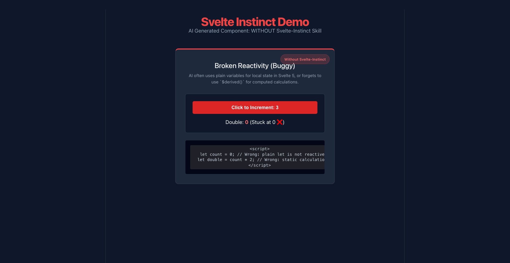
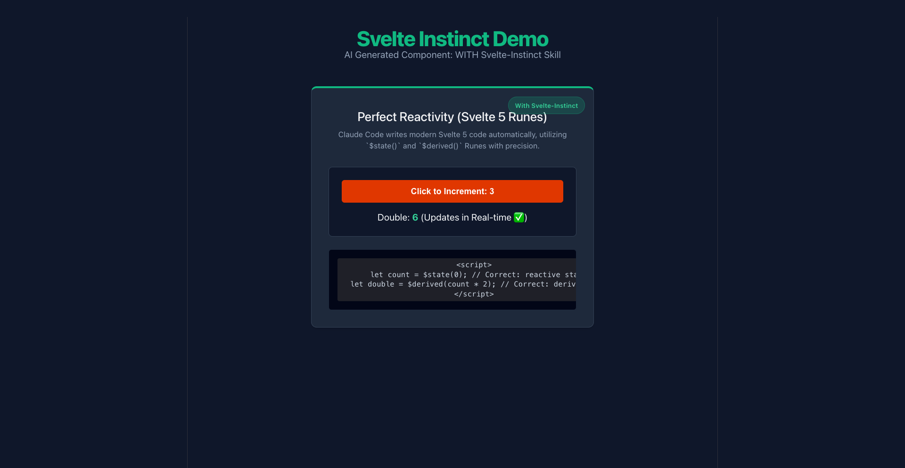

# svelte-instinct

A Claude Code skill that enforces correct Svelte 4 and Svelte 5 best practices, automatically detects Svelte versions in your codebase, and prevents mixing paradigms with React or Vue.

## Installation

Add this skill to your Claude Code agent with:

```bash
npx skills add arsyadal/svelte-instinct --skill svelte-instinct --agent claude-code -g
```

## Comparison

### 1. Generated WITHOUT Svelte-Instinct Skill (Buggy Reactivity)
When AI is not guided, it often writes static properties or mixes legacy syntax, resulting in broken reactivity. In the example below, clicking the button increments the local counter, but the calculated "Double" value remains stuck at `0`:



### 2. Generated WITH Svelte-Instinct Skill (Perfect Svelte 5 Runes)
With the skill active, Claude Code is guided to use `$state()` and `$derived()` Runes correctly. Everything updates dynamically in real-time as expected:



## Features

If your project doesn't have a `package.json` at the workspace root, or you want to explicitly force a specific Svelte version for a file, place one of these comments at the very beginning of the `.svelte` file:

```html
<!-- svelte-version: 4 -->
```
or
```html
<!-- svelte-version: 5 -->
```
